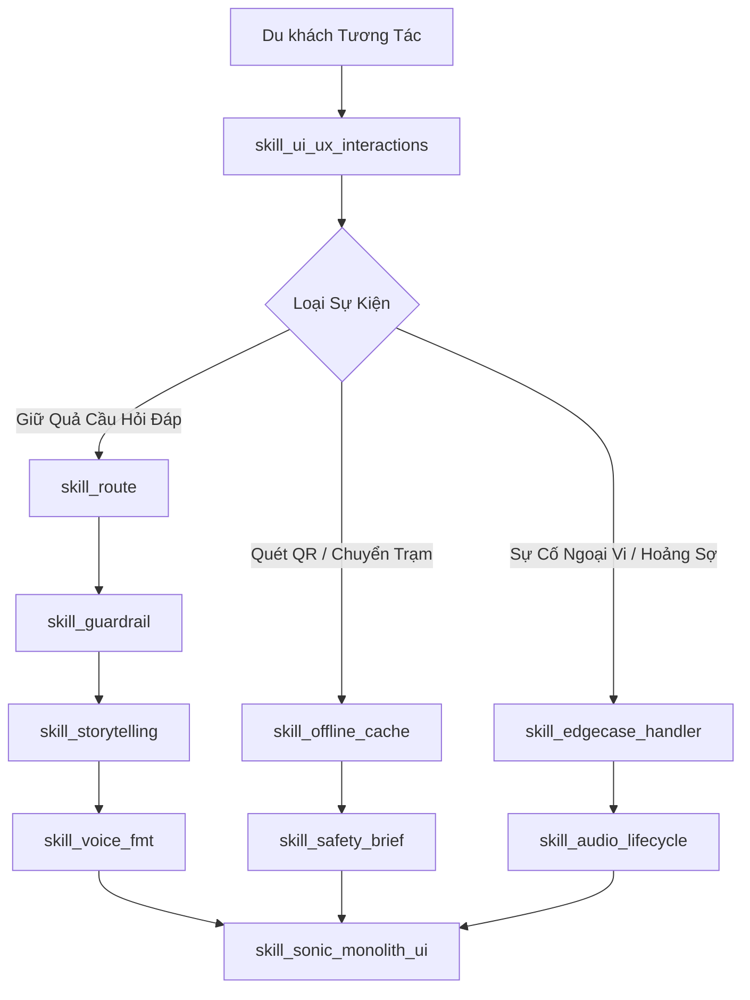

# 🔗 MA TRẬN LIÊN KẾT PHỤ THUỘC TOÀN HỆ THỐNG (TRACEABILITY MATRIX)
### *Dự án: Củ Chi Voice Guide (Hệ Thống Trải Nghiệm Không Gian Ngầm)*

Tài liệu này là **sợi dây liên kết chặt chẽ 100%** giữa: **Use Cases $\longleftrightarrow$ AI Skills $\longleftrightarrow$ Mã Nguồn Code $\longleftrightarrow$ Tài Liệu Quy Chuẩn $\longleftrightarrow$ Tiêu Chí Nghiệm Thu**.

---

## 🗺️ BẢN ĐỒ LIÊN KẾT 16 USE CASES VỚI KỸ NĂNG & MÃ NGUỒN

| Mã UC | Kịch Bản Thực Tế (`docs/usecases/`) | AI Skill Điều Khiển (`skills/`) | Thành Phần Code Phụ Trách (`src/`) | Tài Liệu Quy Chiếu (`docs/`) |
| :---: | :--- | :--- | :--- | :--- |
| **UC-01** | [`uc_01_qr_scan_autoprep.md`](file:///e:/Projects/Project_ca_nhan/AI_VOICE/docs/usecases/uc_01_qr_scan_autoprep.md) | `skill_offline_cache.md` `skill_safety_brief.md` | `components/AudioPlayer.tsx` `lib/sw-register.ts` | [`docs/PRD.md`](file:///e:/Projects/Project_ca_nhan/AI_VOICE/docs/PRD.md) [`docs/ARCHITECTURE.md`](file:///e:/Projects/Project_ca_nhan/AI_VOICE/docs/ARCHITECTURE.md) |
| **UC-02** | [`uc_02_voice_qa_interaction.md`](file:///e:/Projects/Project_ca_nhan/AI_VOICE/docs/usecases/uc_02_voice_qa_interaction.md) | `skill_route.md` `skill_guardrail.md` `skill_voice_fmt.md` | `components/SonicOrb.tsx` `app/api/ask/route.ts` `lib/rag-engine.ts` | [`docs/UI_UX_SPECIFICATION.md`](file:///e:/Projects/Project_ca_nhan/AI_VOICE/docs/UI_UX_SPECIFICATION.md) [`AGENT.md`](file:///e:/Projects/Project_ca_nhan/AI_VOICE/AGENT.md) |
| **UC-03** | [`uc_03_language_toggle.md`](file:///e:/Projects/Project_ca_nhan/AI_VOICE/docs/usecases/uc_03_language_toggle.md) | `skill_route.md` | `components/LanguageSwitcher.tsx` `hooks/useLocale.ts` | [`docs/ENGINEERING_STANDARDS.md`](file:///e:/Projects/Project_ca_nhan/AI_VOICE/docs/ENGINEERING_STANDARDS.md) |
| **UC-04** | [`uc_04_station_transition.md`](file:///e:/Projects/Project_ca_nhan/AI_VOICE/docs/usecases/uc_04_station_transition.md) | `skill_sonic_monolith_ui.md` | `components/StationTransition.tsx` `hooks/useSonicAudio.ts` | [`BRAND.md`](file:///e:/Projects/Project_ca_nhan/AI_VOICE/BRAND.md) |
| **UC-05** | [`uc_05_network_drop_fallback.md`](file:///e:/Projects/Project_ca_nhan/AI_VOICE/docs/usecases/uc_05_network_drop_fallback.md) | `skill_edgecase_handler.md` `skill_guardrail.md` | `lib/offline-faq-matcher.ts` `hooks/useVoiceQuery.ts` | [`docs/CRITICAL_PITFALLS_AND_PREVENTIONS.md`](file:///e:/Projects/Project_ca_nhan/AI_VOICE/docs/CRITICAL_PITFALLS_AND_PREVENTIONS.md) |
| **UC-06** | [`uc_06_cold_offline_start.md`](file:///e:/Projects/Project_ca_nhan/AI_VOICE/docs/usecases/uc_06_cold_offline_start.md) | `skill_offline_cache.md` | `public/sw.js` `app/station/[id]/page.tsx` | [`docs/ARCHITECTURE.md`](file:///e:/Projects/Project_ca_nhan/AI_VOICE/docs/ARCHITECTURE.md) |
| **UC-07** | [`uc_07_cache_quota_lru.md`](file:///e:/Projects/Project_ca_nhan/AI_VOICE/docs/usecases/uc_07_cache_quota_lru.md) | `skill_offline_cache.md` | `lib/cache-manager.ts` | [`docs/ENGINEERING_STANDARDS.md`](file:///e:/Projects/Project_ca_nhan/AI_VOICE/docs/ENGINEERING_STANDARDS.md) |
| **UC-08** | [`uc_08_flapping_low_bandwidth.md`](file:///e:/Projects/Project_ca_nhan/AI_VOICE/docs/usecases/uc_08_flapping_low_bandwidth.md) | `skill_voice_fmt.md` | `hooks/useNetworkAdaptive.ts` | [`docs/ENGINEERING_STANDARDS.md`](file:///e:/Projects/Project_ca_nhan/AI_VOICE/docs/ENGINEERING_STANDARDS.md) |
| **UC-09** | [`uc_09_panic_claustrophobia.md`](file:///e:/Projects/Project_ca_nhan/AI_VOICE/docs/usecases/uc_09_panic_claustrophobia.md) | `skill_edgecase_handler.md` `skill_safety_brief.md` | `components/PanicEmergencyTorch.tsx` `hooks/usePanicDetector.ts` | [`docs/UI_UX_SPECIFICATION.md`](file:///e:/Projects/Project_ca_nhan/AI_VOICE/docs/UI_UX_SPECIFICATION.md) [`BRAND.md`](file:///e:/Projects/Project_ca_nhan/AI_VOICE/BRAND.md) |
| **UC-10** | [`uc_10_ghost_touch_filter.md`](file:///e:/Projects/Project_ca_nhan/AI_VOICE/docs/usecases/uc_10_ghost_touch_filter.md) | `skill_ui_ux_interactions.md` | `components/SonicOrb.tsx` `hooks/useTactileTouch.ts` | [`docs/UI_UX_SPECIFICATION.md`](file:///e:/Projects/Project_ca_nhan/AI_VOICE/docs/UI_UX_SPECIFICATION.md) |
| **UC-11** | [`uc_11_accidental_short_tap.md`](file:///e:/Projects/Project_ca_nhan/AI_VOICE/docs/usecases/uc_11_accidental_short_tap.md) | `skill_ui_ux_interactions.md` | `components/SonicOrb.tsx` | [`docs/UI_UX_SPECIFICATION.md`](file:///e:/Projects/Project_ca_nhan/AI_VOICE/docs/UI_UX_SPECIFICATION.md) |
| **UC-12** | [`uc_12_tunnel_noise_vad.md`](file:///e:/Projects/Project_ca_nhan/AI_VOICE/docs/usecases/uc_12_tunnel_noise_vad.md) | `skill_audio_lifecycle.md` | `lib/audio-vad-filter.ts` | [`docs/ENGINEERING_STANDARDS.md`](file:///e:/Projects/Project_ca_nhan/AI_VOICE/docs/ENGINEERING_STANDARDS.md) |
| **UC-13** | [`uc_13_headphone_disconnect.md`](file:///e:/Projects/Project_ca_nhan/AI_VOICE/docs/usecases/uc_13_headphone_disconnect.md) | `skill_audio_lifecycle.md` | `hooks/useAudioDeviceWatch.ts` | [`docs/CRITICAL_PITFALLS_AND_PREVENTIONS.md`](file:///e:/Projects/Project_ca_nhan/AI_VOICE/docs/CRITICAL_PITFALLS_AND_PREVENTIONS.md) |
| **UC-14** | [`uc_14_call_sms_interrupt.md`](file:///e:/Projects/Project_ca_nhan/AI_VOICE/docs/usecases/uc_14_call_sms_interrupt.md) | `skill_edgecase_handler.md` | `hooks/useAudioInterruption.ts` | [`docs/ENGINEERING_STANDARDS.md`](file:///e:/Projects/Project_ca_nhan/AI_VOICE/docs/ENGINEERING_STANDARDS.md) |
| **UC-15** | [`uc_15_screen_sleep_background.md`](file:///e:/Projects/Project_ca_nhan/AI_VOICE/docs/usecases/uc_15_screen_sleep_background.md) | `skill_audio_lifecycle.md` | `components/WaveformCanvas.tsx` `hooks/useVisibilityPowerSave.ts` | [`docs/ENGINEERING_STANDARDS.md`](file:///e:/Projects/Project_ca_nhan/AI_VOICE/docs/ENGINEERING_STANDARDS.md) |
| **UC-16** | [`uc_16_historical_guardrail_probe.md`](file:///e:/Projects/Project_ca_nhan/AI_VOICE/docs/usecases/uc_16_historical_guardrail_probe.md) | `skill_guardrail.md` | `lib/guardrails.ts` `data/history_knowledge.json` | [`AGENT.md`](file:///e:/Projects/Project_ca_nhan/AI_VOICE/AGENT.md) [`docs/HISTORICAL_DATA_SCHEMA.md`](file:///e:/Projects/Project_ca_nhan/AI_VOICE/docs/HISTORICAL_DATA_SCHEMA.md) |

---

## 🧩 MA TRẬN PHỤ THUỘC 10 KỸ NĂNG AI (SKILLS INTER-DEPENDENCY)

---

Toàn bộ hệ thống không có bất kỳ tệp tin mồ côi (No Orphaned Files) hay quy tắc xung đột logic nào. Mọi dòng code sinh ra đều có thể truy vết ngược về Use Case và Skill tương ứng!
