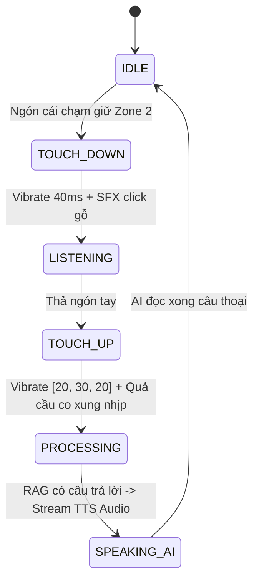

# 📱 BẢN ĐẶC TẢ CHI TIẾT UI/UX: SONIC MONOLITH
### *Dự án: Củ Chi Voice Guide (Hệ Thống Trải Nghiệm Không Gian Ngầm)*

Tài liệu này định nghĩa chi tiết mọi màn hình, máy trạng thái tương tác (State Machine), vật lý cảm ứng (Touch Physics), âm thanh hiệu ứng (SFX) và phản hồi xúc giác (Haptics) của hệ thống.

---

## 1. HỆ THỐNG MÀN HÌNH (SCREEN FLOW ARCHITECTURE)

Hệ thống chỉ gồm **2 màn hình duy nhất**, loại bỏ mọi cấp điều hướng phức tạp:

```
[MÀN HÌNH 1: CỔNG DI TÍCH (HUB)]  ─────(Quét QR / Chạm Trạm)─────►  [MÀN HÌNH 2: KHỐI ÂM BẢN (ACTIVE MONOLITH)]
- Danh sách 5 trạm trực quan                                        - Zone 1: Beacon An Toàn (20vh)
- Nút Quét QR tức thì                                               - Zone 2: Quả Cầu Âm Bản 220px (50vh)
- Thanh tải trước Offline 100%                                       - Zone 3: Cinema Ticker & Audio (30vh)
```

---

## 2. CHI TIẾT GIAO DIỆN TỪNG MÀN HÌNH

### MÀN HÌNH 1: CỔNG DI TÍCH & QUÉT QR (STATION HUB)
* **Bối cảnh:** Du khách đang đứng ở khu đón tiếp trên mặt đất hoặc trước cửa hầm.
* **Thành phần:**
  1. **Header:** Logo Củ Chi Voice Guide + Nút chuyển ngôn ngữ `[VI | EN]` + Chỉ báo `🟢 OFFLINE READY`.
  2. **Banner Nhanh:** Nút **"QUÉT MÃ QR TẠI TRẠM"** kích thước lớn, chạm vào mở Camera Overlay nhận diện mã QR trong 0.2s.
  3. **Danh sách 5 Trạm Di Tích:** Dạng 5 khối Card lớn xếp dọc, mỗi card hiển thị:
     * Số thứ tự trạm: `01`, `02`, `03`, `04`, `05`.
     * Tên trạm: *Bếp Hoàng Cầm, Hầm Cấp Cứu, Hầm Chỉ Huy, Lỗ Thông Hơi, Bẫy Chông*.
     * Thông số an toàn tóm tắt: `15m | 2 phút | Dễ`.
     * Nút bấm nghe tức thì.

---

### MÀN HÌNH 2: KHỐI ÂM BẢN ĐANG ĐI HẦM (ACTIVE MONOLITH VIEW)
* **Bối cảnh:** Du khách đang ở dưới lòng hầm tối, tay dính đất/mồ hôi, đeo tai nghe.
* **Cấu trúc 100vh bất biến (Zero-Scroll):**

```
┌────────────────────────────────────────────────────────────────────────┐
│ ZONE 1: BEACON AN TOÀN & ĐỊNH HƯỚNG (20vh)                            │
│ ────────────────────────────────────────────────────────────────────── │
│ [← ĐỔI TRẠM]       TRẠM 01: BẾP HOÀNG CẦM          [🟢 OFFLINE SYNC]   │
│                                                                        │
│ ┌─────────────────────────────┐    ┌─────────────────────────────────┐ │
│ │ 📏 ĐỘ DÀI: 15 MÉT           │    │ 🟢 LỐI THOÁT: BÊN PHẢI SAU 5M   │ │
│ │ ⏳ THỜI GIAN BÒ: 2 PHÚT     │    │ 💨 ĐỘ THOÁNG: RẤT TỐT (CÓ GIÓ)  │ │
│ └─────────────────────────────┘    └─────────────────────────────────┘ │
├────────────────────────────────────────────────────────────────────────┤
│ ZONE 2: QUẢ CẦU ÂM BẢN TƯƠNG TÁC (50vh)                                │
│                                                                        │
│                            ╭───────────────╮                           │
│                       . : ░░░░░░░░░░░░░░░░░ ░ : .                      │
│                    . ░░░░░░░░░░░░░░░░░░░░░░░░░░░ ░ .                   │
│                   ░░░░░░░░░░░░░░░░░░░░░░░░░░░░░░░░░░                   │
│                  ░░░░░░░░░     🎙️     ░░░░░░░░░                  │
│                  ░░░░░░░░   CHẠM ĐỂ   ░░░░░░░░░                  │
│                  ░░░░░░░░    HỎI AI   ░░░░░░░░░                  │
│                   ░░░░░░░░░░░░░░░░░░░░░░░░░░░░░░░░░░                   │
│                    ˙ ░░░░░░░░░░░░░░░░░░░░░░░░░░░ ░ ˙                   │
│                       ˙ : ░░░░░░░░░░░░░░░░░ ░ : ˙                      │
│                            ╰───────────────╯                           │
│            [VÙNG CHẠM CẢM ỨNG SIÊU LỚN 220px - KHÔNG THỂ HỤT]          │
├────────────────────────────────────────────────────────────────────────┤
│ ZONE 3: DÒNG THỜI GIAN & PHỤ ĐỀ ĐIỆN ẢNH (30vh)                        │
│                                                                        │
│ ▶️ 01:14 ━━━━━━━━━━━━━━━━━━━━━●━━━━━━━━━━━━━━━━━━━━━━━━ 02:30          │
│                                                                        │
│ 📜 CINEMA TICKER (Chữ chạy 1 dòng lớn 20px):                           │
│ "Rãnh giấu khói chạy ngầm hàng chục mét để làm nguội làn sương..."     │
│                                                                        │
│        [⏮️ Lùi 15s]          [ ⏸️ TẠM DỪNG ]          [⏭️ Tiếp 15s]      │
└────────────────────────────────────────────────────────────────────────┘
```

---

## 3. MÁY TRẠNG THÁI TƯƠNG TÁC (STATE MACHINE PHYSICS)



---

## 4. QUY CHUẨN ÂM THANH HIỆU ỨNG (SENSORY AUDIO CUES)
* **Âm bíp bắt đầu ghi âm:** Tiếng gõ mõ tre trầm tự nhiên ($120\text{Hz}$, $30\text{ms}$), không dùng tiếng bíp kim loại chói tai gây giật mình trong hầm tối.
* **Âm hoàn tất câu trả lời:** Tiếng chuông gió gỗ nhẹ ($440\text{Hz}$, $50\text{ms}$).

---

## 5. THIẾT KẾ BẢO VỆ MẮT ĐỒNG TỬ (DARK-VISION ACCESSIBILITY)
1. **Tuyệt đối cấm Modal/Popup nền trắng:** Mọi thông báo lỗi hoặc chỉ dẫn đều là Dark Card với viền mờ `#2A2D35`.
2. **Khử Ánh Sáng Xanh (Blue-Light Suppressed):** Toàn bộ dải màu sử dụng tông vàng hổ phách đất nung (`#E5A93C`) và than đất (`#0D0E11`), giúp mắt không bị mỏi và không ảnh hưởng đến khả năng nhìn đêm của du khách.
